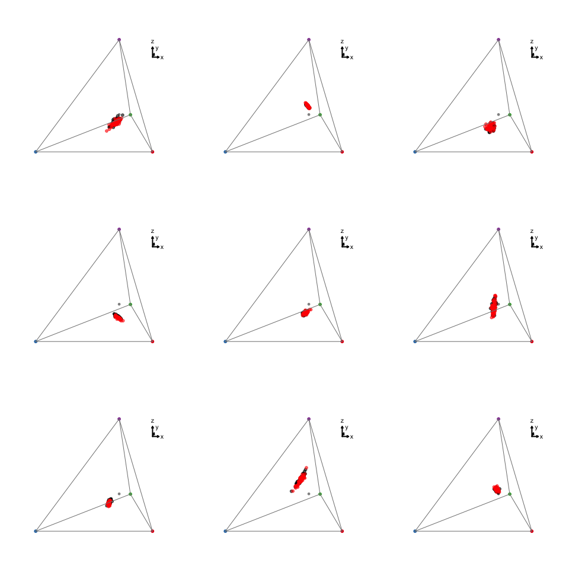
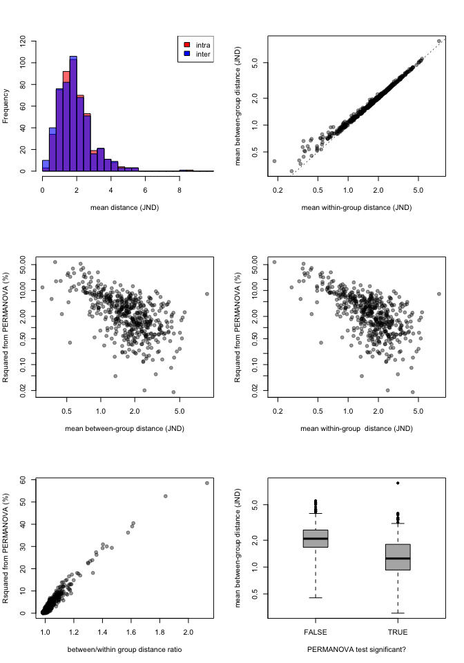

Simulation definitions
----------------------

-   *u**s**m**l* ∼ 𝓁𝓃𝒩(*l**n*(*μ*),*σ*<sup>2</sup>)
-   *μ*<sub>*u**s**m**l*</sub> ∼ 𝒰(10<sup>−6</sup>, 10<sup>0</sup>), covariances = 0
-   *σ*<sub>*u**s**m**l*</sub><sup>2</sup> ∼ ℰ𝓍𝓅(*λ* = 10) (such that $\\overline{\\sigma^2} = 0.1$).
-   Also, *σ*<sub>*A*<sub>*u**s**m**l*</sub></sub><sup>2</sup> = *σ*<sub>*B*<sub>*u**s**m**l*</sub></sub><sup>2</sup>
-   difference between group A and group B: *μ*<sub>*A*<sub>*u**s**m**l*</sub></sub> = *μ*<sub>*B*<sub>*u**s**m**l*</sub></sub> \* *X*, where *X* ∼ 𝒩(*μ* = 1, *σ*<sup>2</sup> = 0.01) (that is, group B *usml* should be about 5% different than group A *usml* 95% of the time)
-   *N* = 50

``` r
simdich <- function(N=50){

  musA <- runif(4, 1e-6,1e0) # vector of means for group A
  #musB <- musA*runif(4, .8, 1.2) # vector of means for group B
  musB <- musA*rnorm(4, 1, 0.01)
  sgsqs <- rexp(4,10) # vector of standard deviations
  
  groupA <- matrix(NA, nrow=N, ncol=4)
  groupA[,1] <- rlnorm(N, meanlog=log(musA[1]), sdlog=sgsqs[1])
  groupA[,2] <- rlnorm(N, meanlog=log(musA[2]), sdlog=sgsqs[2])
  groupA[,3] <- rlnorm(N, meanlog=log(musA[3]), sdlog=sgsqs[3])
  groupA[,4] <- rlnorm(N, meanlog=log(musA[4]), sdlog=sgsqs[4])
  
  groupB <- matrix(NA, nrow=N, ncol=4)
  groupB[,1] <- rlnorm(N, meanlog=log(musB[1]), sdlog=sgsqs[1])
  groupB[,2] <- rlnorm(N, meanlog=log(musB[2]), sdlog=sgsqs[2])
  groupB[,3] <- rlnorm(N, meanlog=log(musB[3]), sdlog=sgsqs[3])
  groupB[,4] <- rlnorm(N, meanlog=log(musB[4]), sdlog=sgsqs[4])
  
  combined <- data.frame(rbind(groupA,groupB))
  
  colnames(combined) <- c('u','s','m', 'l')
  rownames(combined) <- paste(rep(c('gA','gB'), each=N),1:N, sep='')
  
  attr(combined, 'relative') <- FALSE
  
  simpars <- data.frame(rbind(musA, musB, sgsqs))
  colnames(simpars) <- c('u','s','m', 'l')
  rownames(simpars) <- c('muA','muB','ssq')
  attr(combined, 'simpar') <- simpars
  
  combined
  }
```

Simulate 1000 datasets

``` r
simulatedata <- lapply(rep(50, 1000), simdich)

simulatecoldist <- parallel::mclapply(simulatedata, function(x) {
  Y <- coldist(x, achro=FALSE)
  Y$comparison <- NA
  Y$comparison[grepl('A', Y$patch1) & grepl('A', Y$patch2)] <- 'intra.A'
  Y$comparison[grepl('B', Y$patch1) & grepl('B', Y$patch2)] <- 'intra.B'
  Y$comparison[grepl('A', Y$patch1) & grepl('B', Y$patch2)] <- 'inter'
  Y
  }, mc.cores=6)
```

Let's see what some of these simulations look like. We can see how similar groups are. This really is a threshold situation. We can also see that simulations do a pretty good job of covering the entire colorspace, as well as a wide range of correlations and variances.

``` r
source('R/dichtcp.R')

par(mfrow=c(3,3))

for(i in 1:9) dichtcp(simulatedata[[i]])
```



**Step 1:** Run permuational ANOVA (PERMANOVA) on simulated data to ask if group A is different than group B

``` r
adonissim <- parallel::mclapply(simulatecoldist, function(x){
  dmat <- matrix(0, nrow=length(unique(x$patch1)), ncol=length(unique(x$patch1)))
  rownames(dmat) <- colnames(dmat) <- as.character(unique(x$patch1))
  
  for(i in rownames(dmat))
    for(j in colnames(dmat))
      if(length(x$dS[x$patch1 == i & x$patch2 == j]) != 0)
      dmat[i,j] <- dmat[j,i] <- x$dS[x$patch1 == i & x$patch2 == j]
  
  grouping <- gsub('[0-9]','', rownames(dmat))
  
  adonis(dmat~grouping)
  }, mc.cores=6)
```

**Step 2:** Run a linear model to get average within- and between-group distances.

``` r
lmesim <- parallel::mclapply(simulatecoldist, function(x) lmer(dS~comparison - 1 + (1|patch1) + (1|patch2), data=x), mc.cores=6)
```

Let's see what our results look like

``` r
interdist <- unlist(lapply(lmesim, function(x) x@beta[1]))

adonisP <- unlist(lapply(adonissim, function(x) x$aov.tab$'Pr(>F)'[1]))
adonisR2 <- unlist(lapply(adonissim, function(x) x$aov.tab$'R2'[1]))

par(mfrow=c(2,2))

hist(interdist, xlab='mean between-group distance (JND)', breaks=30, col=grey(0.7), main='')
#hist(adonisP)
hist(I(adonisR2*100), xlab='Rsquared from PERMANOVA (%)', breaks=30, col=grey(0.7), main='')
plot(I(adonisR2*100)~interdist, ylab='Rsquared from PERMANOVA (%)', xlab='mean between-group distance (JND)', log='xy', pch=19, col=rgb(0,0,0,0.4))

boxplot(interdist~I(adonisP < 0.05), 
        xlab='PERMANOVA test significant?', ylab='mean between-group distance (JND)', 
        boxwex=0.3, col=grey(0.7), pch=19, log='y')
```



-   There is no association between how well groups can be told apart (PERMANOVA R-squared) and the mean between-group distances
-   There between-group JND distance is not a good predictor of if the groups can be told apart (i.e. if the PERMANOVA is significant)
-   If anything these associations are negative - probably because of the mean-variance relationship in lognormal distributions?

``` r
intradistA <- unlist(lapply(lmesim, function(x) x@beta[2]))
intradistB <- unlist(lapply(lmesim, function(x) x@beta[3]))

par(mfrow=c(2,2))

plot(I(adonisR2*100)~intradistA, ylab='Rsquared from PERMANOVA (%)', xlab='mean within-group A distance (JND)', log='xy', pch=19, col=rgb(0,0,0,0.4))
plot(I(adonisR2*100)~intradistB, ylab='Rsquared from PERMANOVA (%)', xlab='mean within-group B distance (JND)', log='xy', pch=19, col=rgb(0,0,0,0.4))

plot(interdist~intradistA, ylab='mean between-group distance (JND)', xlab='mean within-group A distance (JND)', log='xy', pch=19, col=rgb(0,0,0,0.4))
plot(interdist~intradistB, ylab='mean between-group distance (JND)', xlab='mean within-group B distance (JND)', log='xy', pch=19, col=rgb(0,0,0,0.4))
```


This is annoying, wasn't really what I was trying to simulate. But makes the point accross...

``` r
sessionInfo()
```

    ## R version 3.3.0 (2016-05-03)
    ## Platform: x86_64-apple-darwin13.4.0 (64-bit)
    ## Running under: OS X 10.11.4 (El Capitan)
    ## 
    ## locale:
    ## [1] en_US.UTF-8/en_US.UTF-8/en_US.UTF-8/C/en_US.UTF-8/en_US.UTF-8
    ## 
    ## attached base packages:
    ## [1] stats     graphics  grDevices utils     datasets  methods   base     
    ## 
    ## other attached packages:
    ## [1] lme4_1.1-12          Matrix_1.2-6         vegan_2.4-0         
    ## [4] lattice_0.20-33      permute_0.9-0        scatterplot3d_0.3-37
    ## [7] pavo_0.5-5           rgl_0.95.1441       
    ## 
    ## loaded via a namespace (and not attached):
    ##  [1] Rcpp_0.12.5        cluster_2.0.4      knitr_1.13        
    ##  [4] magrittr_1.5       splines_3.3.0      maps_3.1.0        
    ##  [7] magic_1.5-6        MASS_7.3-45        minqa_1.2.4       
    ## [10] geometry_0.3-6     stringr_1.0.0      tools_3.3.0       
    ## [13] parallel_3.3.0     grid_3.3.0         nlme_3.1-127      
    ## [16] mgcv_1.8-12        htmltools_0.3.5    yaml_2.1.13       
    ## [19] digest_0.6.9       nloptr_1.0.4       mapproj_1.2-4     
    ## [22] formatR_1.4        rcdd_1.1-10        evaluate_0.9      
    ## [25] rmarkdown_0.9.6.10 stringi_1.0-1
